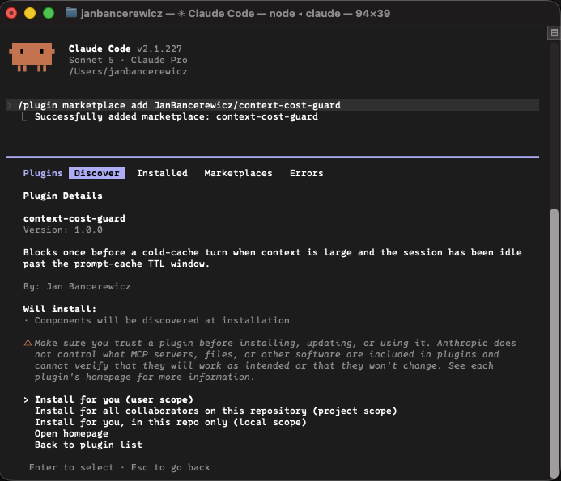
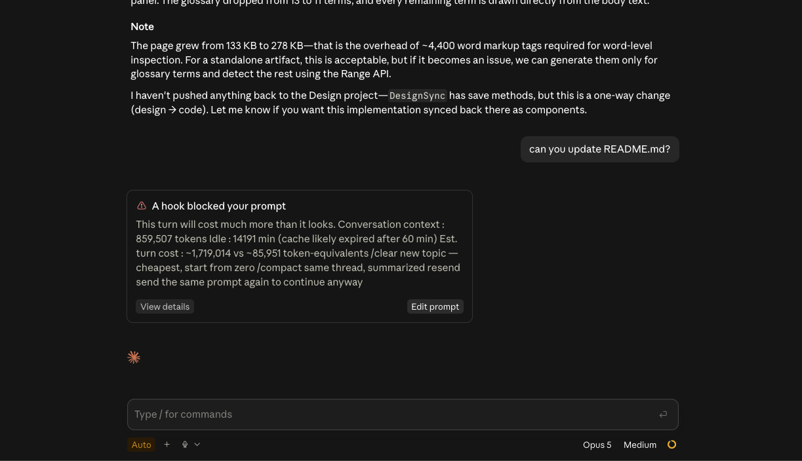

# context-cost-guard

**Open-source Claude Code plugin** that blocks **once** before an expensive cold-cache turn — when your conversation is large *and* you have been idle long enough that the prompt cache has likely expired.

Claude’s Messages API is **stateless**: every turn resends the full conversation. Warm prompt-cache reads bill around **0.1×** input; cold cache writes bill around **2×** (1h TTL) or **1.25×** (5m TTL). The same prompt can cost ~**20×** more after a lunch break on a large session.

This plugin is the **runtime guard**. Pair it with scoping `~/.claude/rules/` (`paths:` frontmatter) and a thin `CLAUDE.md` to cut always-on context.


|               |                                                       |
| ------------- | ----------------------------------------------------- |
| **License**   | [MIT](LICENSE) — free to read, fork, and modify       |
| **Runtime**   | One small Python 3 script + a `UserPromptSubmit` hook |
| **Network**   | None — reads your local transcript only               |
| **Fail mode** | Fail-open: errors never block a turn                  |
| **Language**  | English UI and source                                 |


> Blog article on how it works: [https://janbancerewicz.github.io/portfolio/blog/reduce-claude-code-token-usage](https://janbancerewicz.github.io/portfolio/blog/reduce-claude-code-token-usage)

---


## Install

Requires [Claude Code](https://code.claude.com/docs/en/overview) and `python3` on your `PATH`.
Works both in Desktop version, as well as in terminal Claude Code. Installation via terminal: 

In Claude Code:

```text
/plugin marketplace add JanBancerewicz/context-cost-guard
/plugin install context-cost-guard@context-cost-guard
```




Then **restart Claude Code** (or run `/reload-plugins`). Hooks load at session start; a restart is the reliable way to activate them.

You do **not** need to edit or overwrite `~/.claude/settings.json`. The plugin merges its hook with any hooks you already have.

### Local / development install

```bash
claude --plugin-dir ./context-cost-guard
```

Or add this repo as a local marketplace:

```text
/plugin marketplace add /absolute/path/to/context-cost-guard
/plugin install context-cost-guard@context-cost-guard
```

---


## What it does


| Piece        | Detail                                                                                                        |
| ------------ | ------------------------------------------------------------------------------------------------------------- |
| Event        | `UserPromptSubmit` — runs **before** the API call                                                             |
| Action       | **Block** the turn once with a clear English message (not “warn after you already paid”)                      |
| Trigger      | **Both** must be true: context ≥ `BIG_CONTEXT` **and** idle ≥ `IDLE_MINUTES`                                  |
| Context size | From the last transcript usage record: `input_tokens + cache_read_input_tokens + cache_creation_input_tokens` |
| Idle         | Minutes since the last assistant `timestamp` in the session JSONL transcript                                  |
| Snooze       | After a block, the same session may resend for `SNOOZE_SECONDS` (default 300) without another block           |
| Fail-open    | Bad stdin, missing transcript, corrupt JSON, I/O errors → exit quietly, **never** block                       |

### Example of usage



> In the screenshot above: User sends a short message to a long Claude Desktop session, which would normally trigger a cold cache write of the entire context, billing you heavily for the whole conversation history.
> **However, a warning from the hook pops up to alert the user and prevents the request from executing.**


### Block message

```text
This turn will cost much more than it looks.
Conversation context : 379,250 tokens
Idle                 : 94 min  (cache likely expired after 60 min)
Est. turn cost       : ~758,500 vs ~37,925 token-equivalents

/clear    new topic — cheapest, start from zero
/compact  same thread, summarized
resend    send the same prompt again to continue anyway
```

(The hook joins those lines with Unicode line separators so Claude Code’s block card keeps the line breaks — plain `\n` is collapsed to spaces in that UI.)

- `/clear` — cheapest reset for a new topic
- `/compact` — stay in the thread with a summarized context
- **resend** — send the same prompt again within the snooze window to continue anyway

Snooze state lives at `~/.claude/.context-cost-guard.json` (keyed by `session_id`; entries older than one day are pruned).

### When it stays quiet

- Context under 60 000 tokens (default), **or**
- Idle under 55 minutes (default), **or**
- You already hit the block and are within the 5-minute snooze window, **or**
- Anything goes wrong reading the transcript / stdin (fail-open)

---


## How it works


### Why a “cheap-looking” turn can be expensive

1. Claude Code keeps a transcript of the session (JSONL) with per-turn `usage`.
2. Each new prompt re-sends prior context to the API.
3. While the **prompt cache** is warm, that resend is cheap (cache read ≈ 0.1×).
4. After the cache TTL (commonly ~1 hour), the same bytes become a **cache write** (≈ 2×).
5. If the session is also **large**, the bill jumps hard — even if your new sentence is one line.

The guard estimates “are we past TTL?” from **idle time** and “is it worth warning?” from **last known context size**. It does not call Anthropic’s billing API.

### Decision flow

```text
You submit a prompt
        │
        ▼
UserPromptSubmit hook
        │
        ├─ read session transcript (JSONL) locally
        ├─ measure last context size + idle minutes
        │
        ├─ below thresholds? ──────────────► allow (no output)
        ├─ snoozed for this session? ──────► allow
        │
        └─ otherwise ──────────────────────► block once + write snooze
                                              show cost estimate + options
```


### What the script reads and writes


| Path                                      | Access     | Purpose                       |
| ----------------------------------------- | ---------- | ----------------------------- |
| Session `transcript_path` from hook stdin | Read-only  | Last usage + timestamp        |
| `~/.claude/.context-cost-guard.json`      | Read/write | Per-session snooze timestamps |
| Network                                   | None       | No telemetry, no uploads      |


The whole code is in [context-cost-guard/hooks/context-cost-guard.py](context-cost-guard/hooks/context-cost-guard.py) (~130 lines). Audit it in five minutes.

### Cost estimate shown in the message

Illustrative token-equivalents (not an invoice):

- Warm (cache hit): `context × 0.1`
- Cold (cache write at ~2×): `context × 2`

Check current Anthropic docs for live multipliers and TTL details.

---


## Why you can trust this

**Open source (MIT).** The repo is public. There is no obfuscated binary, no analytics SDK, and no phone-home. If you dislike a default, change three constants or fork the script.

**Fail-open by design.** A broken transcript, missing file, or bad JSON must never trap you mid-thought. The hook exits quietly and the prompt proceeds.

**Block-once + snooze.** The guard cannot lock you out: after the warning, resending within five minutes continues normally.

**Local-only.** It only needs your Claude Code transcript path and a tiny JSON state file under `~/.claude/`.

**Plugin-native install.** Uses the official marketplace/plugin flow and `${CLAUDE_PLUGIN_ROOT}` — no “paste this into your entire `settings.json`” instructions.

**English-only surface.** User-facing messages and source comments are English so behavior matches what international readers expect from the blog CTA.

---


## Extensibility

The policy is intentionally tiny so you can adapt it:


| Knob / seam    | How to extend                                                                            |
| -------------- | ---------------------------------------------------------------------------------------- |
| Thresholds     | Edit `IDLE_MINUTES`, `BIG_CONTEXT`, `SNOOZE_SECONDS` at the top of the script            |
| Message copy   | Change the `message = (...)` string — keep English or localize for your team             |
| State location | Change `STATE_PATH` (still keep it outside the plugin cache directory)                   |
| Trigger logic  | Swap idle-time inference for stricter rules (e.g. always warn above N tokens)            |
| Hook wiring    | `hooks/hooks.json` is standard Claude Code hook config — add matchers or companion hooks |


Team forks can vendor the plugin in a private marketplace, pin a version in `plugin.json` / `marketplace.json`, and ship different defaults per org.

### Same idea as a skill / guard for other LLM providers

Prompt-cache (or “prefix cache”) economics show up beyond Claude Code. The pattern ports cleanly:

1. **Observe** last context size + time since last cached prefix (or last successful cache hit).
2. **Gate** the next request *before* it leaves the client when both “large” and “likely cold”.
3. **Explain** cheaper exits (new session, compact/summarize, or acknowledge and continue).
4. **Snooze** so a deliberate retry is never blocked twice in a row.
5. **Fail open** so tooling never bricks the editor.

Examples of where the same logic can live:


| Surface                                       | Shape                                                                                 |
| --------------------------------------------- | ------------------------------------------------------------------------------------- |
| Claude Code (this repo)                       | `UserPromptSubmit` command hook                                                       |
| Cursor / other IDEs                           | Rule, skill, or pre-submit hook if the host exposes one                               |
| Custom agents (LangGraph, home-grown CLIs)    | Middleware before `messages.create` / chat completions                                |
| OpenAI / Gemini / others with cached prefixes | Same thresholds; map multipliers to that provider’s cache-read vs cache-write pricing |
| Team “skills” packs                           | Document the policy in a `SKILL.md` and keep a tiny script as the enforcer            |


This repository ships the **Claude Code hook** because that is where the blog’s install CTA lives. The algorithm is provider-agnostic; only transcript parsing and hook registration are Claude-specific.

---


## Knobs

Edit constants at the top of  
`context-cost-guard/hooks/context-cost-guard.py`  
(then reinstall / reload the plugin, or restart Claude Code):


| Constant         | Default | Meaning                                                                 |
| ---------------- | ------- | ----------------------------------------------------------------------- |
| `IDLE_MINUTES`   | `55`    | Block only if idle at least this many minutes (tuned for ~1h cache TTL) |
| `BIG_CONTEXT`    | `60000` | Block only if last-turn context is at least this many tokens            |
| `SNOOZE_SECONDS` | `300`   | After a block, allow resends for this many seconds                      |


---


## Caveats

1. **Time-based TTL assumption** — The hook infers cache expiry from **idle time**, assuming a **1 hour** prompt-cache TTL (`IDLE_MINUTES=55`). On accounts / routes that use a **5 minute** TTL (or other overage behavior), it can **under-warn**: the cache may already be cold while idle is still under 55 minutes.
2. **Not a billing meter** — Token-equivalent numbers are rough (`0.1×` warm / `2×` cold). They are for intuition, not invoices.
3. **Needs a transcript with usage** — Brand-new sessions or missing usage records fail open (no block).
4. **Python 3 required** — The hook command is `python3 …`.

---


## Uninstall / disable

```text
/plugin disable context-cost-guard@context-cost-guard
```

or

```text
/plugin uninstall context-cost-guard@context-cost-guard
```

Optional cleanup:

```bash
rm -f ~/.claude/.context-cost-guard.json
```

To remove the marketplace catalog from Claude Code:

```text
/plugin marketplace remove context-cost-guard
```

---


## Repository layout

This git repo is a **single-plugin marketplace**:

```text
.claude-plugin/marketplace.json          # marketplace catalog
context-cost-guard/
  .claude-plugin/plugin.json             # plugin manifest
  hooks/hooks.json                       # UserPromptSubmit → command hook
  hooks/context-cost-guard.py            # guard script (English messages)
  README.md
  LICENSE
docs/screenshots/                        # PNG/WebP captures for the README
LICENSE
README.md
```

Hook command (plugin-safe path):

```json
"command": "python3 \"${CLAUDE_PLUGIN_ROOT}/hooks/context-cost-guard.py\""
```

---

## License

[MIT](LICENSE) — use it, fork it, ship a stricter variant for your team.